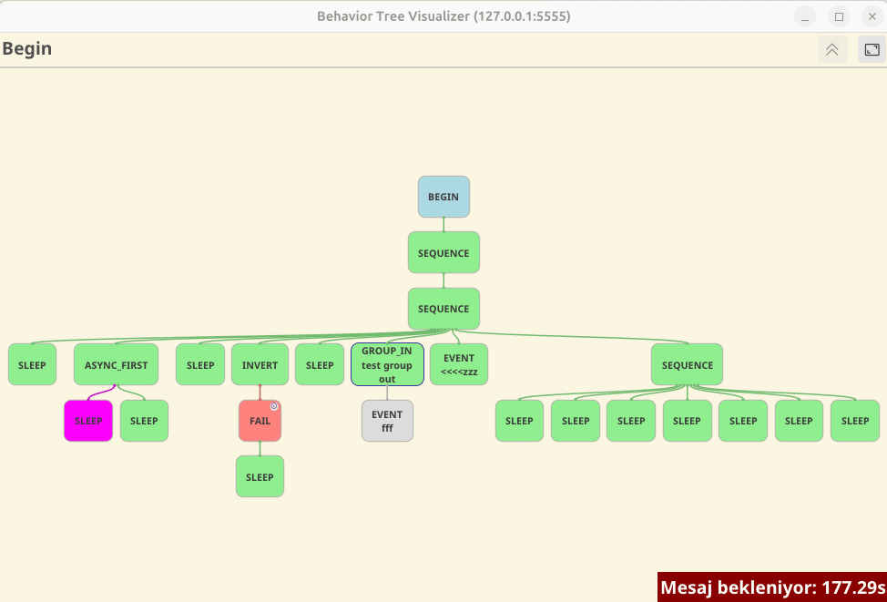
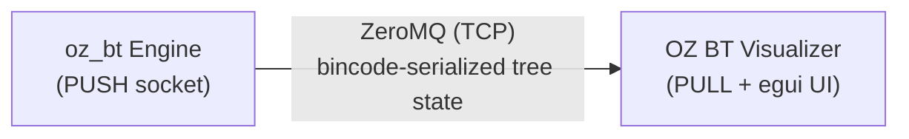

# OZ BT Visualizer

A real-time, interactive Behavior Tree visualizer built with **Rust** and [**egui**](https://github.com/emilk/egui). It connects to the [**oz_bt**](https://github.com/omer0909/oz_bt) behavior tree engine over ZeroMQ to render live tree execution with smooth panning, zooming, and group navigation.

> [!NOTE]
> This repository contains the visualizer client only. The behavior tree engine that produces the data stream lives in the main [**oz_bt**](https://github.com/omer0909/oz_bt) repository.

---

## ✨ Features

- **Real-time Streaming** — Connects via ZeroMQ (`PULL` socket) to receive live tree updates with sub-second latency.
- **Interactive Canvas** — Pan by dragging, zoom with the scroll wheel, and click group nodes to dive into subtrees.
- **Group / Subtree Navigation** — Breadcrumb path shows your current depth; click the up-arrow or a group node to move between levels.
- **State-aware Coloring** — Nodes are instantly color-coded based on execution state:
  - 🟦 `Running`
  - 🟩 `Succeeded`
  - 🟥 `Failed`
  - 🟪 `Cancelled`
  - ⬜ `None` / Idle
- **Comment Tooltips** — Hover over nodes with an info badge to read attached comments.
- **Connection Status** — Visual indicator when the data stream is interrupted or waiting.
- **Lightweight & Portable** — Native performance with a minimal footprint; runs on Linux, macOS, and Windows.

---

## 🎬 Preview

<p align="center">
  
</p>

---

## 🚀 Quick Start

### Prerequisites

- [Rust](https://rustup.rs/) toolchain (stable, 1.75+)
- A running **oz_bt** server publishing tree state over ZeroMQ

### Build and Install

```bash
cargo install --git https://github.com/omer0909/oz_bt_visualizer --branch main
```

### Uninstall

```bash
cargo uninstall oz_bt_visualizer
```

### Run

```bash
. "$HOME/.cargo/env"
oz-bt-visualizer --host 127.0.0.1 --port 5555
```

The window will open and immediately start listening for tree data on the specified endpoint.

---

## ⚙️ Configuration

The visualizer can be configured via CLI arguments or environment variables.

| Argument | Short | Environment Variable | Default | Description |
|----------|-------|----------------------|---------|-------------|
| `--port` | `-p`  | `BT_PORT`            | `5555`  | ZeroMQ PULL socket port |
| `--host` |       | `BT_HOST`            | `127.0.0.1` | Behavior tree server IP |

**Example with env vars:**

```bash
. "$HOME/.cargo/env"
BT_HOST=192.168.1.42 BT_PORT=6000 oz-bt-visualizer
```

---

## 🖱️ Controls

| Action | Input |
|--------|-------|
| **Pan** | Drag with middle or left mouse button |
| **Zoom** | Scroll wheel (zooms toward cursor) |
| **Enter Group** | Left-click a group node (`GroupIn`) |
| **Exit Group** | Click the up-arrow button in the top bar |
| **Reset View** | Click the frame-corners button in the top bar |

---

## 📡 Protocol

The visualizer consumes binary-encoded `VisualizerMessage` packets from a ZeroMQ `PULL` socket.

```rust
pub struct VisualizerMessage {
    pub start_time: chrono::DateTime<chrono::Utc>,
    pub send_time: chrono::DateTime<chrono::Utc>,
    pub watch_content: WatchContent,
}
```

Each message contains the full serialized tree state. The visualizer diffs `start_time` to detect server restarts and flashes a toast notification on new connections.

---

## 🏗️ Architecture



- **Networking**: `zmq` with `poll` on the socket file descriptor; a background thread triggers egui repaints as soon as new data arrives.
- **Rendering**: Pure immediate-mode GUI via `egui`. Custom layout engine calculates node widths and positions dynamically.
- **Serialization**: `bincode-next` + `serde` for compact, fast message decoding.

---

## 🛠️ Development

```bash
# Run in debug mode with logs
cargo run -- --host 127.0.0.1 --port 5555

# Format & lint
cargo fmt
cargo clippy -- -D warnings
```

### Asset Notes
The visualizer bundles a custom **NotoSans-Bold** font and the **Phosphor** icon font for crisp UI rendering at all zoom levels.

---

## 🤝 Contributing

Contributions are welcome! If you find a bug or have an idea for an improvement, feel free to open an issue or submit a pull request on the main [oz_bt](https://github.com/omer0909/oz_bt) repository.

---

## 📄 License

This project is licensed under the MIT License. See the main repository for details.

---

<p align="center">
  Built with 🦀 Rust + egui
</p>
